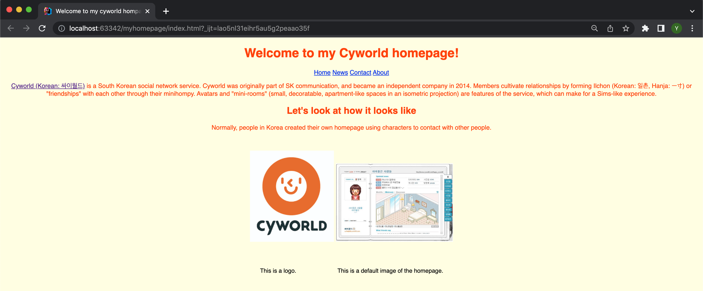
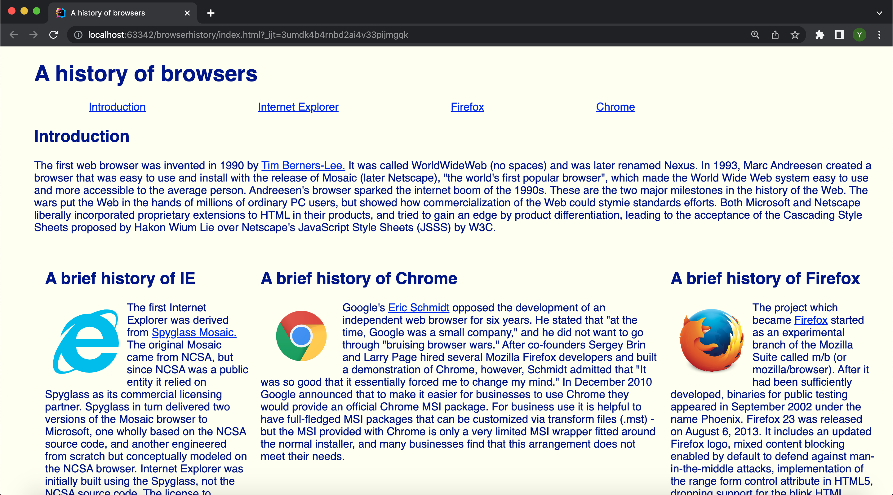
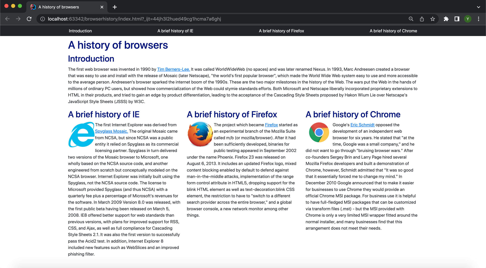

## First sight

Yes, it was tricky and complicated when I first met Bootstrap. Personally, unlike other normal programming learners, I only heard about how powerful it is to know about HTML/CSS, and this was my first time getting into learning it in detail. As a warm-up, freecodecamp helped a lot to acquire the basic concept of HTML/CSS, but it was totally different when we actually use and make websites even though those are not a complete version. However, I found myself having interest during the few weeks of learning UI frameworks from raw HTML/CSS to Bootstrap. UI frameworks is, in simple terms, a guide to successful and elegant designs for web developers. It speeds up our development process and it enables us to make the codes straightforward. Also, it is easy to prevent repetitions among multiple projects, creating those quickly. When I was using Bootstrap, I didn’t know that this is more complicated than what I thought. It could mess up the entire code when I put several 
classes in the outline of other 
 classes. I do not want to be pessimistic about how difficult it is; I switched my thought about how valuable it is for me to “wear on” UI framework as a potential web developer. Bootstrap offers a vast selection of plugins and components from the open source community, so it just takes a few clicks to begin using my front-end resource. Furthermore, Bootstrap flexibility includes easy integration into the platform’s API layer. Designs can work in harmony with pre-existing pages, websites, applications and operating software. 

Those are what I worked with raw HTML/CSS.
  

  
And here’s Murphy’s Bar & Grills website and browerhistory website I played around using Bootstrap 5. 
  

  
I can describe that the two websites using Bootstrap look more “stereoscopic” than myhomepage website. Rather than placing contexts using columns, I could use a container class which gives a nice padding and alignment as shown on the websites. 

## Return to the start
  
I put in a few hours when first modifying the website, but it gave me an opportunity to go over further into how I can develop my ability to design the codes. Still, it is true that utilizing UI frameworks is challenging. I would rather stick to more about those platforms for high-quality building structures in my coding. 

  
  
  

