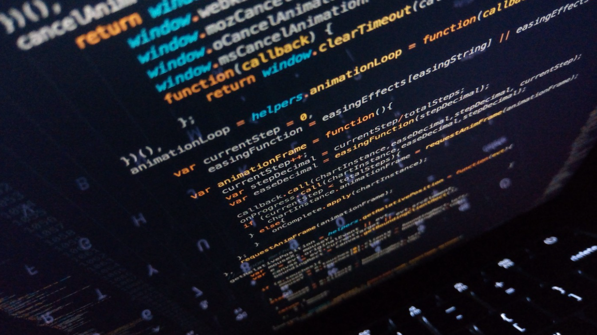

## Previous Background

Before facing Javascript, I learned and experienced other languages, C#, C++, and Java. I have been working with C# and C++ mainly and those are what I prefer the most. 
As I learned what Javascript is, it brought my attention to the difference between Javascript and other programming languages. 

The main difference is that it can be used in both the front-end and back-end of web development, and all non-primitive data types in Javascript are actually objects. 
In other words, data types such as arrays, functions, or symbols inherit all the properties of the Object prototype. 

The important thing that reminds me of diving into this language is that Javascript accelerates program execution by eliminating the wait time for server connections. 
Based on those backgrounds, hopefully I could discover more opportunities in further exercises.

## Entry of Javascript

It has been a week since I started to explore Javascript, and I have noticed that the athletic software engineering is challenging and requires plenty of practice. 
What I learned during the beginning of the first week in ICS314 class, compared to other programming languages, Javascript has different ways to develop the codes and utilize them related to algorithms in terms of building the overall functions. 

But, I realized that the learning background and knowledge that I have acquired are compatible with Javascript. 
On top of that, practicing WODs will be a significant new experience to go beyond what I have been taught. 

