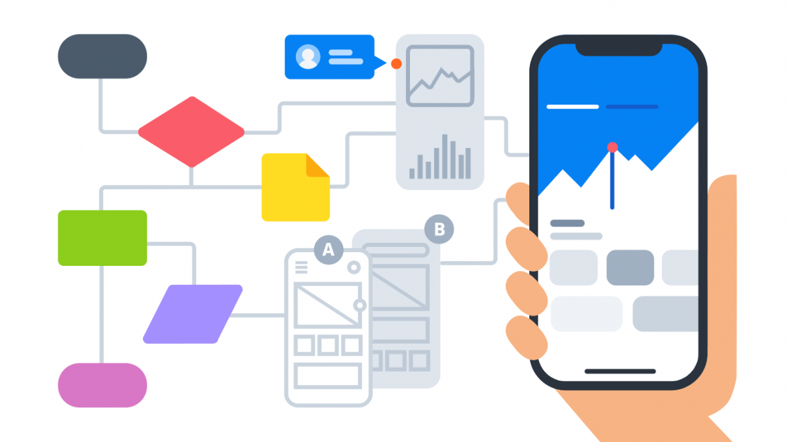

  

## What I learned so far

During this course, I gained a deeper understanding of various software engineering concepts. In particular, I found two topics particularly interesting and relevant beyond web application development: Open Source Software Development and Agile Project Management.

## Beyond web application development

Open Source Software Development is a software development approach that allows developers to share and collaborate on code. Open Source Software Development offers several benefits, such as faster development, better code quality, and increased innovation. Furthermore, this approach provides an opportunity for me to contribute to a project and gain recognition in the software community.

One of the main advantages of Open Source Software Development is the ability to collaborate with other people on a project. During the semester, our final project was to develop a web application as a team. We could work together to solve problems and develop new features, which can result in faster development cycles and better quality code. This approach also allows us to leverage existing code and libraries, which can save time and effort.
Open Source Software Development is not limited to web application development. It can be used for any software development project, including desktop and mobile applications, operating systems, and databases. For instance, I can also contribute to the Linux operating system that is open-source projects.

Agile Project Management is one approach to managing software development projects that emphasizes flexibility and collaboration. It is characterized by its iterative approach to development, where the project is broken down into small, manageable chunks, and each chunk is developed in a sprint. 
This approach can be applied to any software development project, as well as to non-software development projects. For example, during working on our project, which is called “mele-manoa”, designed to bring musicians of UH together for jam sessions or performing bands, one of the members in the team working on a specific task assigned could use Agile Project Management to ensure that the code and its functionality are developed properly, with regular feedback from each member. 
One specific style of Agile Project Management that we learned about in this course is Issue Driven Project Management. This style of Agile Project Management is characterized by its focus on identifying and prioritizing issues that need to be resolved. By identifying and prioritizing issues, our team could make sure that the most important issues had to be solved first so that we could approach each goal of the milestone.
I could see myself using Issue Driven Project Management in a variety of contexts, not just in web application development. For example, while I was working on the project, especially styling the website, I could use Issue Driven Project Management to ensure using the github environment that whenever I finished my own issues, I could pull my task to the “done” column so that my other members could work on the next issues. Furthermore, in our project page in the github, we specified the description of each issue for the purpose of better understanding for other members. Similarly, if I were working on a non-technical project, such as organizing an event, I could use Issue Driven Project Management to ensure that all of the issues related to the event were identified and resolved before the event took place.

## Marked
In conclusion, this course has provided me with a broader understanding of software engineering concepts beyond web application development. Open Source Software Development and Agile Project Management are two topics that I found particularly interesting and relevant. These concepts can be applied to any software development project, and understanding them can help me become a better software developer.

