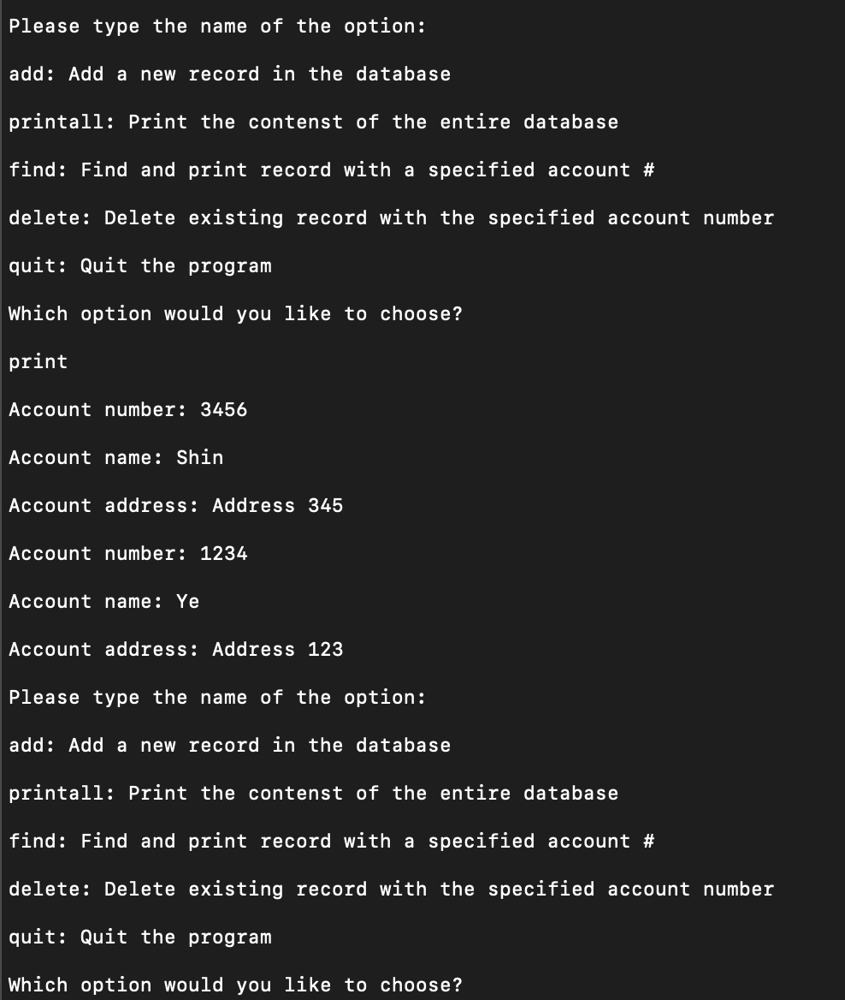

This project was done in the ICS 212 program structure class in Fall 2022 semester. First we were given to create a program that stores information about account numbers, names, and addresses using C language. The project that I’m showing is built by C++. The program is controlled by a user-interface and database that allow users to interact with other options. The general idea is that to access the database in software, the banker interacts with the user-interface, which displays data and accepts inputs while accessing the database part. After building a user-interface, we were assigned to capsulize our database by defining the given classes that contain the several methods.

The user-interface part takes care of the following tasks.

-It displays an introductory message at the beginning, menu, and menu options.

-add: it adds a new record in the database in descending order.

-printall: it prints all records in the database in descending order.

-find: It finds records with a specified account #.

-delete: it deletes existing records from the database using the account # as a key.

-quit: it quits the program properly.

In the database part, compared to the project 1 built by C#, we also used constructor and destructor, which are the special member functions of the class. Constructor was used to initialize the object of the class, and the destructor was called by the compiler when the object was destroyed.

Another difference between project 1 and 2 is that we implemented debug mode using preprocessor directives, instead of command line arguments. When we run the debug mode executable, additional output was printed on the screen such as the name of functions called and parameters passed. 

[Here is the source code](https://github.com/YeeunS/YeeunS.github.io/tree/main/projects/Banker)

What I could learn from this project is that the initial design of the program is essential. All I had to do was to implement pre-designed functions that required specific functions. It brought my previous experience that I used to start building the program without any pre-frame of the work. In that sense, this project became a valuable exercise for me as a guideline for future projects to be carried out, not only in the college but also in my future work field. 

