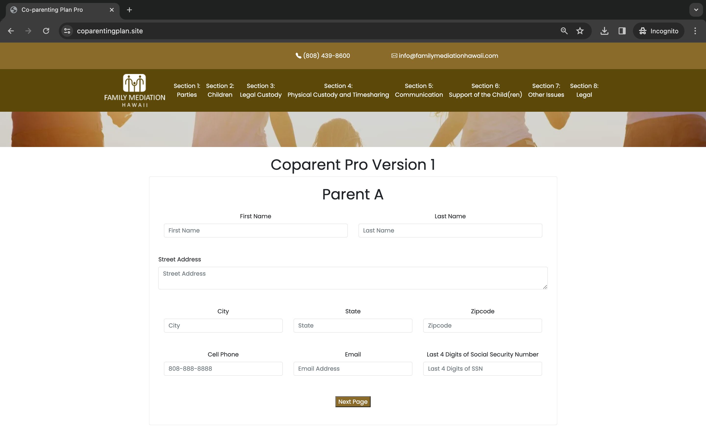
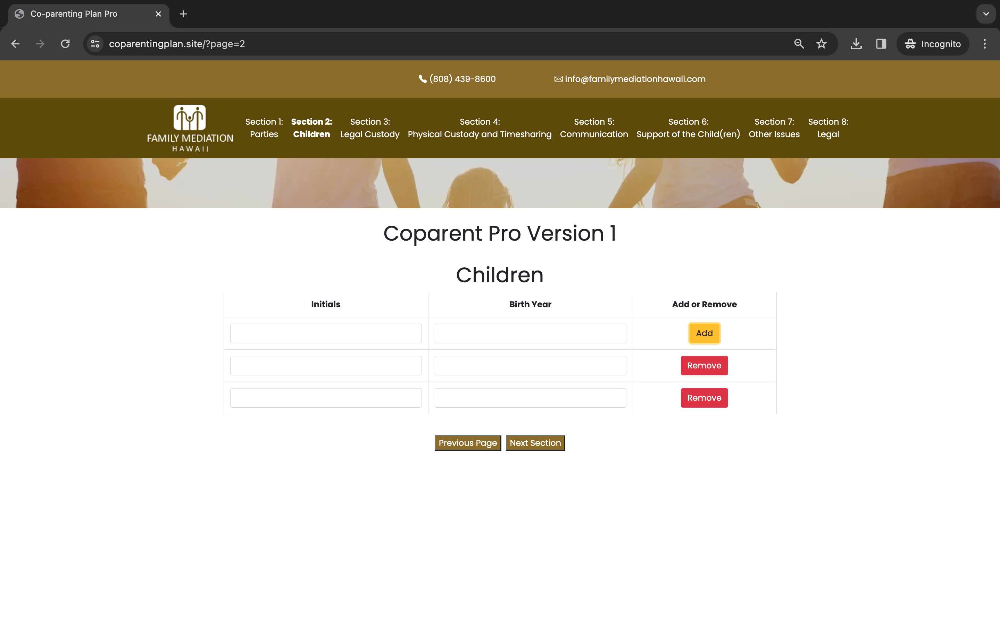
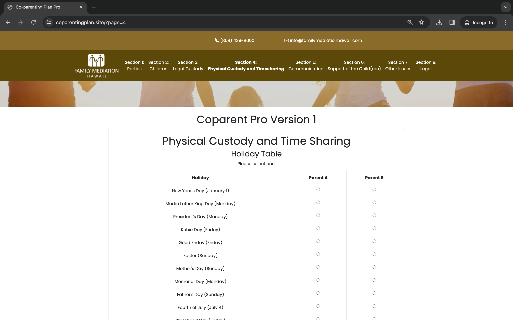
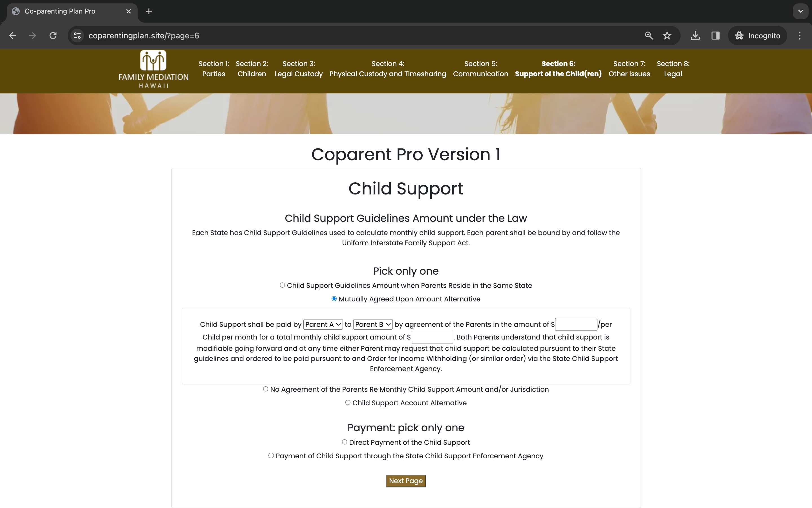

As a capstone project, me and my teammates worked on internal Co-Parenting Plan Builder for our sponsors and clients. 

Our aim to achieve the project is that we help separating and divorcing parents create Co-Parenting Plans so that they both understand their rights and responsibilities in order to reduce parental conflict and create better outcomes for children.  
Using the index/database of all potential Co-Parenting Plan Agreements we've create, we would like help building a more user-friendly, internal interface to allow non-lawyer mediators to create Co-Parenting Plans using check box provisions and sample calendars.  
Generally, Co-Parenting Plans include terms for legal custody, schedule during the school year, schedule during the breaks, holiday schedules, and other agreements related to support, extracurricular, educational, travel with the children, communication, and other child-related issues. 

The goal/outcome would be to have a Co-Parenting Plan that is automatically populated with names, addresses, child info, etc. and also the agreed upon terms of the Co-Parenting Plan.
We used PHP based framework with HTML/CSS format style, building each page with severl forms for clients. Our team was assigned to each sections and worked on different parts such as optional issues they would like to make a plan with our sponsor, forms for general information of parent A/B, and so on.

Here are images of our internal builder website.

  

  

  

  

[Co-Parenting Plan website](https://coparentingplan.site/)

