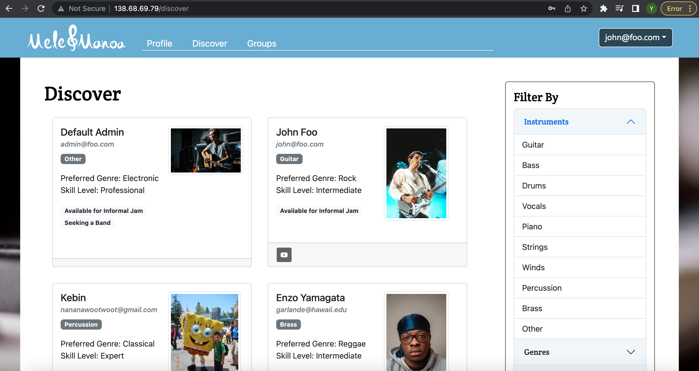
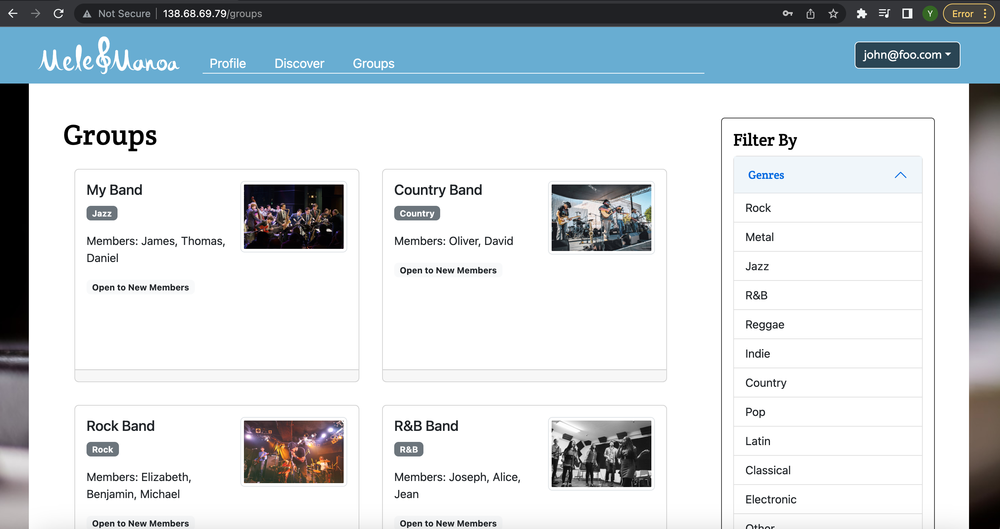

  

As a final project, I worked on creating a new web application with 4 members of team. Mele Manoa is a web application designed to bring musicians of UH together for jam sessions or performing bands. It is an easy way for them to find others with similar tastes and compatible musical abilities, by allowing students to create a profile indicating their musical tastes, their musical capabilities, and their musical goals. They can then find and connect with other musicians of similar interests using Mele Manoa and schedule informal jams or other kinds of meetups with new friends. Mele Manoa also allows musicaians to discover other musical groups to join or to enjoy.
We used Bootstrap 5 and React to build and design the web application, MongoDB to save and collect the data collections, Meteor to run the application locally, and also Digital Ocean to deploy the application.
Mele Manoa has main three pages, profile, discover, and groups. Each page can be used for the users to create an account, editing their own profiles so that other users can look via discover pages joining the jam sessions.
I mainly worked on designing the website, creating register profile and edit profile pages with the formatted cards. The most interesting part of working on is that even though all the functionalities and data collections were built properly, I found that the page designed can be changed or may not shown on the website depending on user's input.
We had to figure out the problem is, and it was not simple to catch the issue that we faced. 
Especially, when we have to show the website updated, we had to deploy whenever needed. I could compare our data collections while operating MongoDB, and it really helped to figure out the error in it. The fun part of using MongoDB is that I could delete or add the datas directly into MongoDB, which requires to set the default data as 0. If there is any discrepancy on both sides of MongoDB and our functions, it clearly showed the error and helped me to correct the issues.

Here are images of our website.

  

  

  

[Mele-Manoa website.](http://138.68.69.79/)
[Mele-Manoa homepage.](https://mele-manoa.github.io/)

