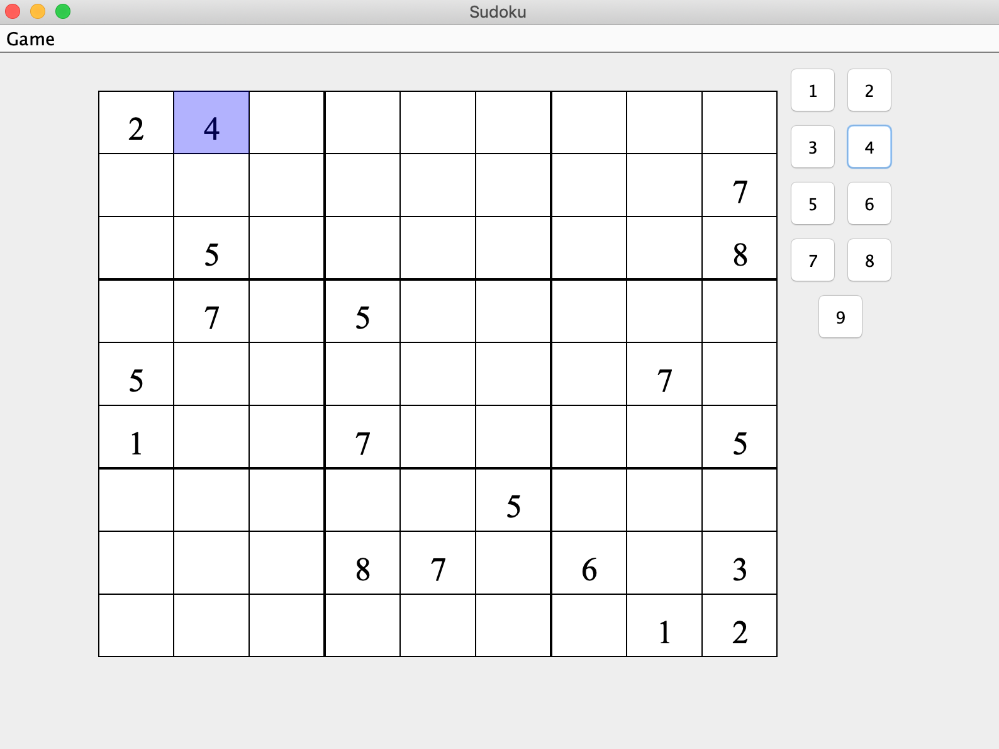

This project was done after the spring semester in 2021. For the extension of GUI using Java language, I created a simple sudoku puzzle game to enhance my technical skills regarding utilizing programming languages, and preparing for the new software field. 

It is a number placement puzzle game consisting of a simple 9x9 grid, with some of the cells containing numbers. For players, the job is to fill in the blank cells with the digits from 1 to 9 in a way that no digits repeat in each row, column, and inner 3x3 square. 

To create a drawing surface, I defined a subclass of SudokuPanel and created an object beloning to this class and used it in my program. Other fundamental subclasses were defined to make the program show the window so that the player actually access it.

Here is the image of how the game looks.

<div class="text-center p-4">
  
</div>

Here is the code below.

```java
public class SudokuPuzzle {

  protected String [][] board;
  // Table to determine if a slot is mutable
  protected boolean [][] mutable;
  private final int ROWS;
  private final int COLUMNS;
  private final int BOXWIDTH;
  private final int BOXHEIGHT;
  private final String [] VALIDVALUES;
  
  public SudokuPuzzle(int rows,int columns,int boxWidth,int boxHeight,String [] validValues) {
    this.ROWS = rows;
    this.COLUMNS = columns;
    this.BOXWIDTH = boxWidth;
    this.BOXHEIGHT = boxHeight;
    this.VALIDVALUES = validValues;
    this.board = new String[ROWS][COLUMNS];
    this.mutable = new boolean[ROWS][COLUMNS];
    initializeBoard();
    initializeMutableSlots();
  }
  
  public SudokuPuzzle(SudokuPuzzle puzzle) {
    this.ROWS = puzzle.ROWS;
    this.COLUMNS = puzzle.COLUMNS;
    this.BOXWIDTH = puzzle.BOXWIDTH;
    this.BOXHEIGHT = puzzle.BOXHEIGHT;
    this.VALIDVALUES = puzzle.VALIDVALUES;
    this.board = new String[ROWS][COLUMNS];
    for(int r = 0;r < ROWS;r++) {
      for(int c = 0;c < COLUMNS;c++) {
        board[r][c] = puzzle.board[r][c];
      }
    }
    this.mutable = new boolean[ROWS][COLUMNS];
    for(int r = 0;r < ROWS;r++) {
      for(int c = 0;c < COLUMNS;c++) {
        this.mutable[r][c] = puzzle.mutable[r][c];
      }
    }
  }
  ...
  }
  
```
[Here is the source code.](https://github.com/YeeunS/YeeunS.github.io/tree/main/projects/Sudoku)
