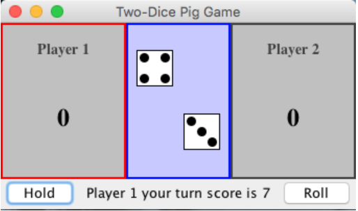
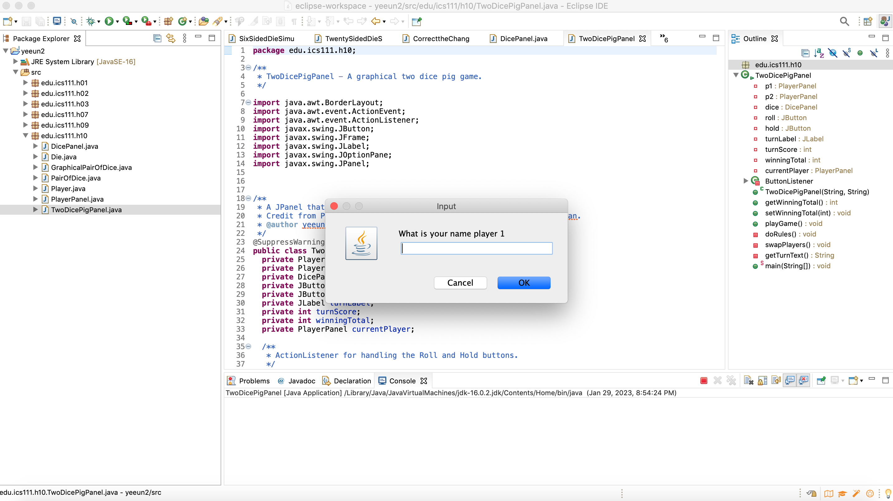
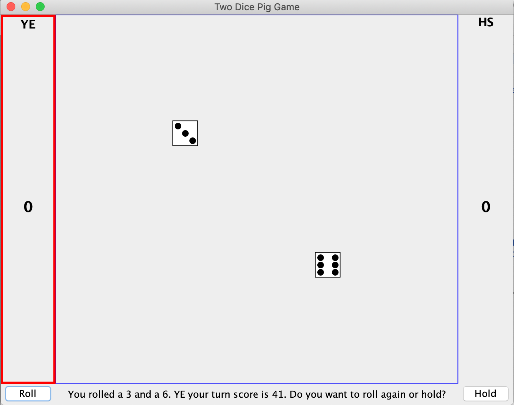

This project was done in ICS 111 Introduction to Computer Science during the Spring 2021 semester after I changed my major from Political Science to Computer Science. Personally, it was the hardest time to acquire the concept of programming in this field, but it resulted in a big asset for me to ponder my overall programming projects. We learned Java language and were introduced to GUI programming to create a two-dice pig game. 

<div class="text-center p-4">
  
  
</div>

The goal for this project was to create the two-dice game graphically with a JPanel that can store a group of elements in the code. Also, we had to use a JFrame, which acts as the main window of an application. 

To make the program function, it should add the following functionality to it.

-It asks for the player names and uses them.

-It asks for the number of points to determine who wins and use it.

-It informs the players what is going on with each roll.

Here is the code of how it works.

```java
public TwoDicePigPanel(String player1Name, String player2Name) {
    String player1Name1 = JOptionPane.showInputDialog("What is your name player 1");
    this.p1 = new PlayerPanel(player1Name1);
    String player2Name1 = JOptionPane.showInputDialog("What is your name player 2");
    this.p2 = new PlayerPanel(player2Name1);
    @SuppressWarnings("unused")
    String winningTotal = JOptionPane.showInputDialog("what is your total score");
    this.currentPlayer = p1;
    this.dice = new DicePanel();
    this.roll = new JButton("Roll");
    roll.addActionListener(new ButtonListener());
    this.hold = new JButton("Hold");
    hold.addActionListener(new ButtonListener());
    this.turnLabel = new JLabel("", JLabel.CENTER);
    this.turnScore = 0;   
    this.turnLabel.setText(getTurnText());
    setLayout(new BorderLayout());
    add(p1, BorderLayout.WEST);
    add(p2, BorderLayout.EAST);
    add(dice, BorderLayout.CENTER);
    JPanel panel = new JPanel();
    panel.setLayout(new BorderLayout());
    panel.add(roll, BorderLayout.WEST);
    panel.add(turnLabel, BorderLayout.CENTER);
    panel.add(hold, BorderLayout.EAST);
    add(panel, BorderLayout.SOUTH);
  }
  
```
[Here is the source code.](https://github.com/YeeunS/YeeunS.github.io/tree/main/projects/Dice)

To wrap up the entire learning of Java, this project helped to understand and make a frame of the knowledge regarding what the programming is. Java was complicated for newbies to enter the software engineering field, but I could step forward to the next level of development with the various assignments and projects during the class.


